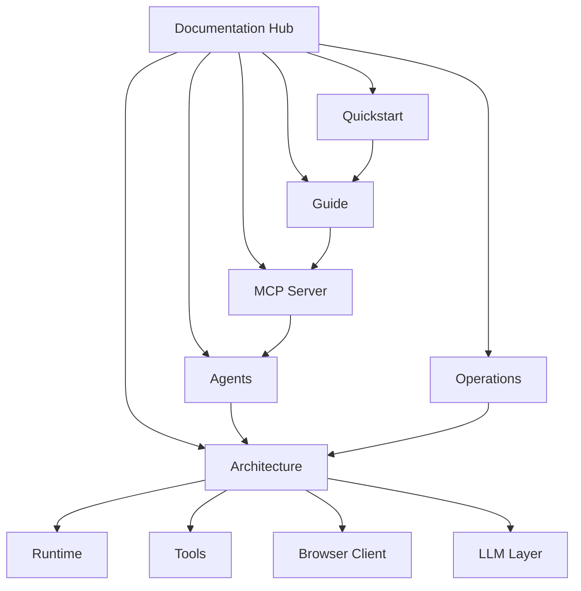

# CamoFox MCP Documentation

CamoFox MCP exposes CamoFox Browser to MCP clients. The docs are intentionally compact: workflow pages first, architecture details in one folder, and a small agent entry file for LLMs.

## Reading Tree



## Start Here

| Goal | Read |
| --- | --- |
| Install CamoFox MCP and verify a client | [Quickstart](quickstart.md) |
| Use tabs, snapshots, refs, selectors, downloads, and profiles | [Guide](guide.md) |
| Understand transports, tool layers, lifecycle, and security | [MCP Server](mcp-server.md) |
| Give an AI agent the right workflows and cleanup rules | [Agents](agents.md) |
| Understand internals and extension points | [Architecture](architecture/index.md) |
| Build, test, configure, deploy, or troubleshoot | [Operations](operations.md) |

## Core Model

```text
MCP client
  -> camofox-mcp
  -> camofox-browser
  -> Camoufox-backed browser
```

`camofox-mcp` does not automate the browser directly. It registers MCP tools, validates arguments with Zod, tracks tab state, manages profile files, routes optional LLM workflows, and forwards requests to `camofox-browser`.

## Related Topics

- [Quickstart](quickstart.md)
- [MCP Server](mcp-server.md)
- [Agents](agents.md)
- [Architecture](architecture/index.md)
