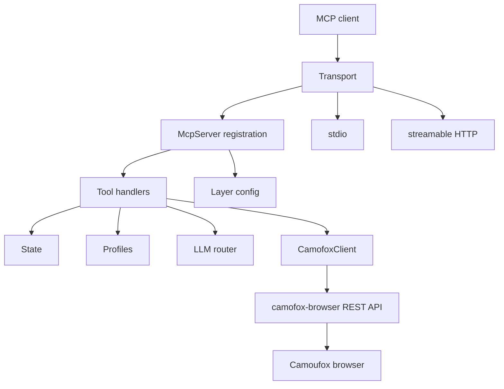

# Architecture

CamoFox MCP is a TypeScript MCP adapter between AI clients and `camofox-browser`.

## System Tree

## Layers

| Layer | Files | Responsibility |
| --- | --- | --- |
| Transport | `src/index.ts`, `src/http.ts` | Start stdio or HTTP MCP transport. |
| Server | `src/server.ts`, `src/layers.ts` | Register tools and prompts according to layer config. |
| Tools | `src/tools/*` | Validate MCP arguments, call state/client/profile/LLM helpers, return MCP content. |
| State | `src/state.ts` | Track tabs, histories, task context, TTL cleanup, and process cleanup. |
| Browser client | `src/client.ts` | Call `camofox-browser` REST endpoints and map failures. |
| Profiles | `src/profiles.ts` | Persist cookie profiles with validation and atomic writes. |
| LLM | `src/llm/*`, `src/prompts/*` | Run semantic tools, model routing, fallback, and JSON repair. |

## Boundaries

- CamoFox MCP does not launch browser automation directly during normal tool calls.
- `camofox-browser` owns browser contexts, fingerprints, downloads, and DOM execution.
- MCP state is process-local and bounded.
- Profiles are the only persistent data managed by CamoFox MCP.
- Tool layer flags affect registration only; they do not change browser-server behavior.

## Related Topics

- [Runtime](runtime.md)
- [Tools](tools.md)
- [Browser client](browser-client.md)
- [LLM layer](llm.md)
