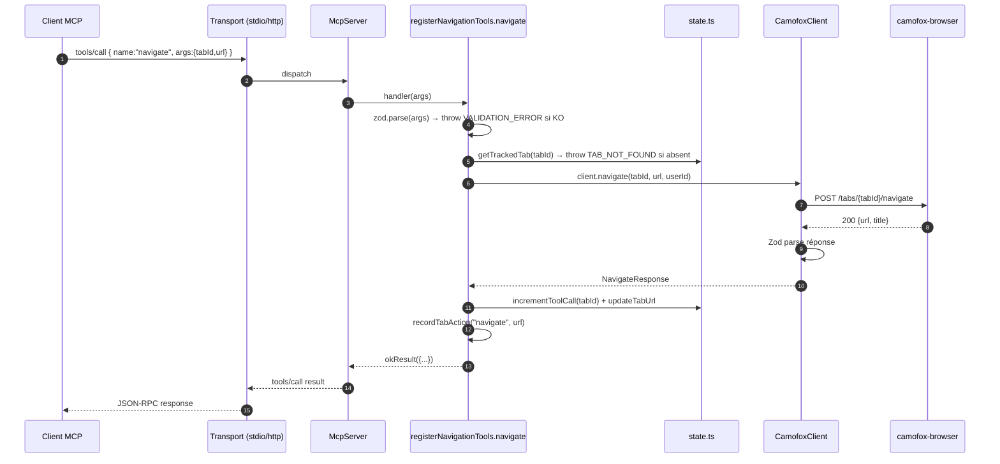
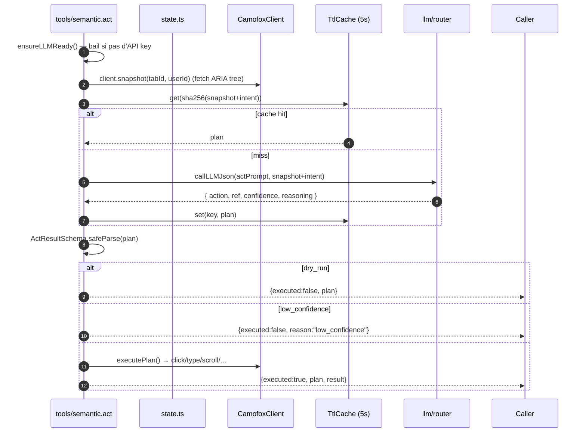
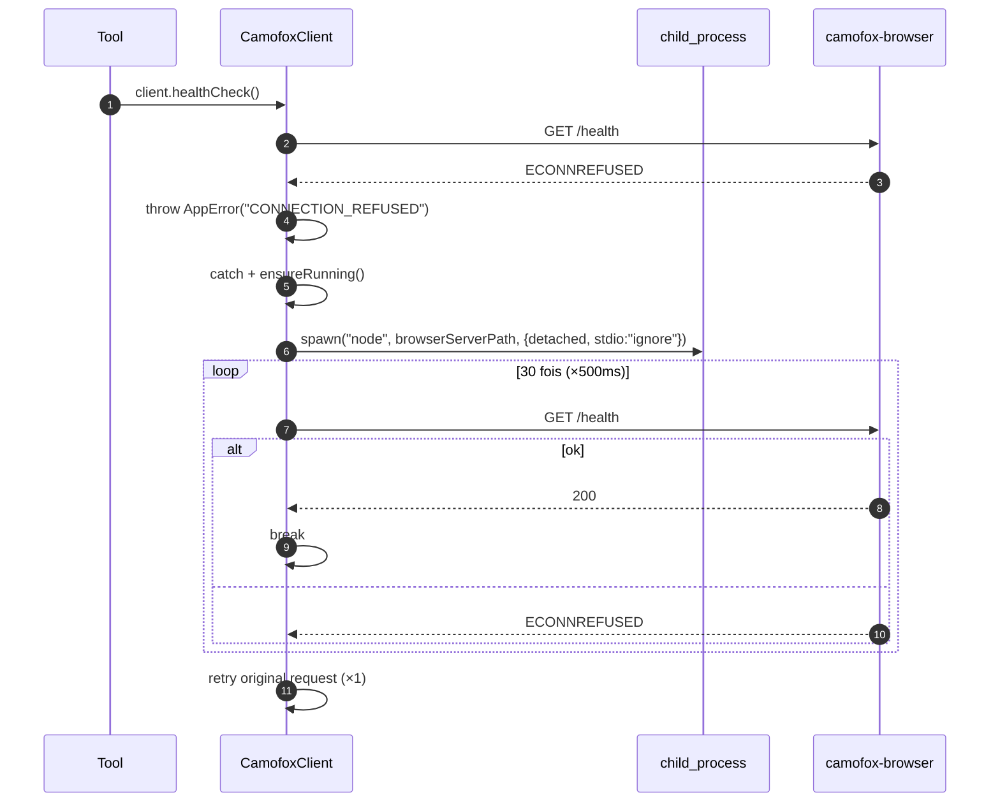
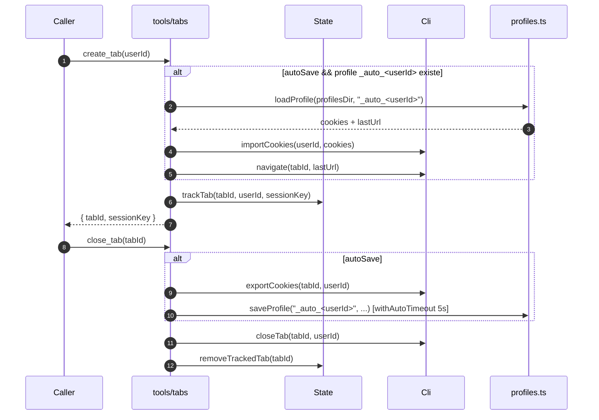

# Flux de données — d'un appel MCP à la réponse

## Cas 1 — Appel d'un tool simple (ex : `navigate`)

**Invariants :**
- Toute exception est attrapée par `try/catch` au niveau du handler et convertie via `toErrorResult(error)` (voir [03-runtime/error-model.md](../03-runtime/error-model.md)).
- Le tab DOIT exister dans `state.ts` avant tout appel (sauf `create_tab`).
- Chaque tool incrémente `tracked.toolCalls` (sauf erreurs précoces).

## Cas 2 — Tool sémantique (ex : `act`)

**Spécificités :**
- Cache TTL 5 s, max 50 entrées. Clé = `sha256(toolName + snapshot + intent + schema?)`.
- Si `LLM_DISABLED` → réponse normale (pas une erreur MCP) avec `{ error: "LLM_DISABLED: ..." }` dans le payload — le client peut continuer.
- `min_confidence` défaut = 0.6, paramétrable.
- Le `_meta` retourné inclut `model`, `latency_ms`, `repaired`, `used_fallback` pour la télémétrie.

## Cas 3 — Auto-start du browser server

`ensureRunning()` n'est tenté qu'une seule fois par requête (`isRetry` flag) pour éviter les boucles infinies.

## Cas 4 — Cycle de vie d'un tab avec auto-save

L'auto-save est **best-effort** : `withAutoTimeout(savePromise, 5000)`. Si le save plante ou timeout, la fermeture du tab continue normalement et `autoSaved: false` est renvoyé.
