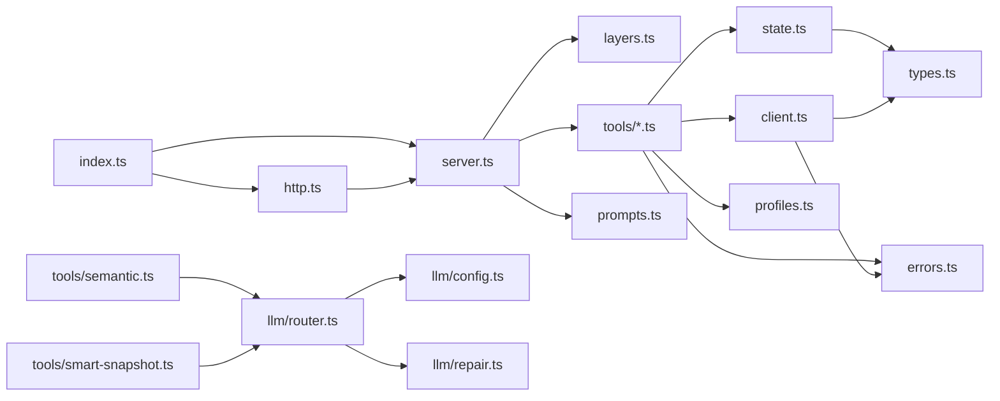

# Vue d'ensemble — Architecture en 5 couches

`camofox-mcp` n'effectue **aucune** automatisation directe : c'est un **adaptateur MCP** qui traduit les appels d'outils MCP (JSON-RPC sur stdio ou HTTP) en requêtes HTTP vers un serveur tiers `camofox-browser` (Playwright + Camoufox anti-détection).

```
┌─────────────────────────────────────────────────────────────────────┐
│  Client MCP  (Claude Desktop / VS Code / Cursor / OpenClaw)         │
└──────────────────┬──────────────────────────────────────────────────┘
                   │  JSON-RPC 2.0  (stdio ou HTTP/StreamableHTTP)
                   ▼
┌─────────────────────────────────────────────────────────────────────┐
│  L1 — TRANSPORT             src/index.ts · src/http.ts              │
│  ─ StdioServerTransport     (un seul process, un seul tab MCP)      │
│  ─ StreamableHTTPServer     (express, stateless, port 3000, RL 60/m)│
└──────────────────┬──────────────────────────────────────────────────┘
                   │
                   ▼
┌─────────────────────────────────────────────────────────────────────┐
│  L2 — SERVER & TOOL REGISTRATION       src/server.ts · src/layers.ts│
│  ─ McpServer (SDK 1.26)                                             │
│  ─ Layered registration : L0 (always) + L1 (semantic) + LEGACY      │
│  ─ Picks profile lean | full | custom                               │
└──────────────────┬──────────────────────────────────────────────────┘
                   │
                   ▼
┌─────────────────────────────────────────────────────────────────────┐
│  L3 — TOOLS                            src/tools/*.ts (16 fichiers) │
│  47 tools regroupés par catégorie. Chaque tool :                    │
│   1. parse Zod                                                      │
│   2. récupère le TabInfo (state.ts)                                 │
│   3. délègue au client HTTP                                         │
│   4. enregistre l'action / met à jour le tab                        │
│   5. encapsule via okResult / toErrorResult                         │
└──────────┬─────────────────────┬───────────────────────┬────────────┘
           │                     │                       │
           ▼                     ▼                       ▼
┌──────────────────┐  ┌──────────────────────┐  ┌─────────────────────┐
│ L4 — STATE       │  │ L4 — LLM ROUTER      │  │ L4 — PROFILES       │
│ src/state.ts     │  │ src/llm/*.ts         │  │ src/profiles.ts     │
│ Map<tabId,Tab>   │  │ OpenAI-compat unique │  │ atomic write +Mutex │
│ TTL sweep, hist. │  │ retry+repair JSON    │  │ schema v1           │
└──────────────────┘  └──────────────────────┘  └─────────────────────┘
                                  │
                                  ▼
┌─────────────────────────────────────────────────────────────────────┐
│  L5 — HTTP CLIENT                       src/client.ts (1172 LOC)    │
│  ─ fetch() + Zod schemas pour valider les réponses                  │
│  ─ Auto-start de camofox-browser si CONNECTION_REFUSED              │
│  ─ Retry idempotent ×1 après spawn                                  │
└──────────────────┬──────────────────────────────────────────────────┘
                   │  HTTP/1.1
                   ▼
┌─────────────────────────────────────────────────────────────────────┐
│  Serveur EXTERNE  camofox-browser (Playwright + Camoufox)           │
│  http://localhost:9377  (par défaut)                                │
└─────────────────────────────────────────────────────────────────────┘
```

## Principes de conception

### 1. MCP-first, pas browser-first
Tous les types publics (`TabInfo`, `ClickStrategy`, `SnapshotResponse`…) sont définis dans [src/types.ts](../../src/types.ts) et façonnés pour le format MCP `ToolResult` ([src/errors.ts:22](../../src/errors.ts#L22)), pas pour le DOM. Le client HTTP est isolé dans [src/client.ts](../../src/client.ts) et peut être moqué dans les tests sans toucher au reste.

### 2. Layered tools (lean / full / custom)
La quantité de tools exposés est paramétrable via un système de **layers** ([src/layers.ts](../../src/layers.ts)) :
- **L0** (`core: true`, toujours) : health, tabs, navigation, sessions, profiles, downloads
- **L1** (`semantic: true`) : extract, observe, act, find_element_by_prompt, execute
- **LEGACY** (`legacy: true`) : interaction granulaire + observation détaillée + batch + search + smart-snapshot

Le profil `full` (défaut) active L0+L1+LEGACY ; `lean` active L0+L1 ; `custom` permet le contrôle fin.

### 3. Fail-soft sur le LLM
Aucun tool LLM ne plante le serveur si l'API key manque ou si le provider est down :
- `LLMDisabledError` → `okResult({ error: "LLM_DISABLED: ..." })`
- Fallback model automatique sur erreur primaire
- Réparation JSON tolérante (`parseJsonLenient`) avant rejet

### 4. Stateless HTTP
Le transport HTTP crée **un nouveau McpServer + Transport par requête** ([src/http.ts:55-95](../../src/http.ts#L55)). Aucune session HTTP persistée → scaling horizontal trivial.

### 5. State minimal et borné
La seule mémoire process-wide est `Map<tabId, TabInfo>` ([src/state.ts](../../src/state.ts)) avec :
- **MAX_TABS = 100** (rejet `MAX_TABS_EXCEEDED`)
- **TTL = 1 800 000 ms** (30 min, sweep périodique)
- **Task history capped à 10** entries par tab
- **Visited URLs capped à 50** par tab

### 6. Atomicité des fichiers profil
Persistance des cookies via tmp + `rename()` + `chmod 0o600` ([src/profiles.ts:140-180](../../src/profiles.ts#L140)) protégée par un `Mutex` par chemin pour éviter les races sur auto-save concurrentes.

## Diagramme de dépendances internes



## Hors-périmètre (ce que camofox-mcp ne fait PAS)

- **Pas de Playwright direct** : c'est `camofox-browser` qui orchestre Playwright.
- **Pas d'auth utilisateur** : `userId` est un identifiant logique pour l'isolation côté browser, pas un user système.
- **Pas de DB** : seuls les profils (cookies) sont persistés sur disque (`~/.camofox-mcp/profiles/`).
- **Pas de queue / job runner** : chaque tool call est synchrone request/response.
