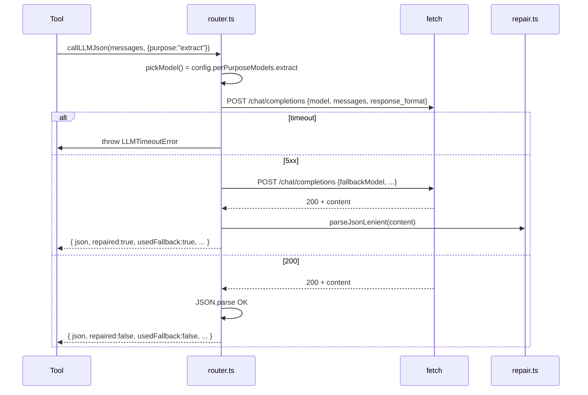

# LLM Router

Module : [`src/llm/router.ts`](../../src/llm/router.ts) (421 LOC). **Point d'entrée unique** pour tous les appels LLM faits par le serveur — concrètement par les tools `extract`, `observe`, `act`, `find_element_by_prompt` ([tools/semantic.ts](../../src/tools/semantic.ts)) et `smart_snapshot` ([tools/smart-snapshot.ts](../../src/tools/smart-snapshot.ts)).

## Responsabilités

1. Sélectionner le bon modèle selon le **purpose** (`extract`/`observe`/`act`/`vision`/…)
2. Convertir le format message agnostique en payload **OpenAI chat-completions**
3. Gérer timeouts, fallback model, JSON repair, télémétrie
4. Exposer un helper haut-niveau `callLLMJson<T>()` pour les tools attendant du JSON structuré

## Pourquoi un seul format de transport ?

Tous les providers (OpenRouter, OpenAI, Gemini OpenAI-compat, custom proxy) acceptent le format `POST /chat/completions` body:

```json
{
  "model": "...",
  "messages": [{"role": "system|user|assistant", "content": "..." | [parts]}],
  "max_tokens": 10000,
  "temperature": 0,
  "response_format": {"type": "json_object"}
}
```

Anthropic natif (`/v1/messages`) est différent → le routeur **force** le passage par OpenRouter pour Anthropic afin de garder une seule HTTP path.

## Erreurs typées

```ts
class LLMDisabledError    extends Error { code = "LLM_DISABLED"; }
class LLMTransportError   extends Error { code = "LLM_TRANSPORT_ERROR"; status?; }
class LLMTimeoutError     extends Error { code = "LLM_TIMEOUT"; }
```

Convention : `LLMDisabledError` est **soft** (le tool retourne `okResult({error: "LLM_DISABLED: ..."})`), les autres sont propagées et catchées par le `try/catch` du tool.

## Conversion de messages

```ts
type LLMContentPart =
  | { type: "text"; text: string }
  | { type: "image"; mimeType: string; data: string };  // base64

type LLMMessage = {
  role: "system" | "user" | "assistant";
  content: string | LLMContentPart[];
};

// Conversion vers OpenAI :
//   text  →  { type: "text", text }
//   image →  { type: "image_url", image_url: { url: "data:<mime>;base64,<data>" } }
```

`hasVisionParts(messages)` détecte la présence d'une image → bascule sur `visionModel`.

## Sélection du modèle

```ts
function pickModel(config, opts, isVision): string {
  if (opts.model) return opts.model;                            // override explicite
  if (isVision)   return opts.model ?? config.visionModel;     // multimodal
  if (opts.purpose && config.perPurposeModels[opts.purpose])
    return config.perPurposeModels[opts.purpose];               // per-purpose
  return config.defaultModel;                                   // fallback générique
}
```

Purposes reconnus : `summarize`, `extract`, `act`, `observe`, `find_element`, `vision`.

## Tentative HTTP

```ts
async function attemptOpenAICompat({ config, model, messages, opts, isVision }) {
  const internalCtrl = new AbortController();
  const timer = setTimeout(() => internalCtrl.abort("timeout"), opts.timeoutMs ?? config.timeoutMs);
  if (opts.signal)
    opts.signal.addEventListener("abort", () => internalCtrl.abort("aborted"), { once: true });

  const body = {
    model,
    messages: messages.map(messageToOpenAI),
    max_tokens: opts.maxTokens ?? config.maxTokens,
    temperature: opts.temperature ?? config.temperature,
    ...(wantsJson ? { response_format: { type: "json_object" } } : {})
  };

  const res = await fetch(`${config.apiUrl}/chat/completions`, {
    method: "POST",
    headers: {
      "content-type": "application/json",
      "authorization": `Bearer ${config.apiKey}`,
      // OpenRouter recommande ces headers de citation :
      "HTTP-Referer": "https://github.com/redf0x1/camofox-mcp",
      "X-Title": "camofox-mcp"
    },
    body: JSON.stringify(body),
    signal: internalCtrl.signal
  });

  if (!res.ok) throw new LLMTransportError(await res.text(), res.status);
  return parseResponse(res);
}
```

**Détails importants :**
- Signal **composable** : timeout interne ET signal externe (`opts.signal` → `AbortController` du tool) sont mergés via une seule `AbortController`.
- Timeout par défaut **30 000 ms** (`config.timeoutMs`), override possible par `opts.timeoutMs`.
- `response_format: json_object` activé si `config.jsonFormat: true` ET `purpose !== "vision"` ET `responseFormat !== "text"`.

## Stratégie de fallback

```text
attemptOpenAICompat(primary_model)
  → success → return
  → error
     ↓
   if config.fallbackModel && fallbackModel !== primary
     → attemptOpenAICompat(fallback_model)
        → success → return (counters.fallbackCalls++)
        → error → re-throw
   else → re-throw
```

Le fallback est tenté une seule fois. Si les deux échouent, l'erreur primaire est levée.

## Réparation JSON

Après réception du `content` du modèle :

```text
1. tenter JSON.parse(content)        → ok ? return
2. stripMarkdownFences(content)       → enlève ```json ... ```
3. parseJsonLenient(stripped)         → extrait { ... } outermost si nécessaire
4. JSON.parse de cette extraction     → ok ? counters.repairedCalls++; return repaired
5. sinon throw LLMTransportError("Failed to parse JSON")
```

Détails dans [json-repair.md](json-repair.md).

## Télémétrie

```ts
type LLMTelemetryEvent = {
  ts: string;
  purpose: string;
  model: string;
  provider: string;
  status: "ok" | "error" | "fallback_used" | "repaired";
  latencyMs: number;
  usage?: { prompt: number; completion: number; total: number };
  error?: string;
};

onLLMTelemetry((event) => { /* sink */ });
```

Plusieurs sinks supportés. Aucun sink ne peut throw — try/catch interne.

## Counters agrégés (exposés via `get_stats`)

```ts
interface RouterCounters {
  totalCalls: number;
  okCalls: number;
  errorCalls: number;
  repairedCalls: number;
  fallbackCalls: number;
  totalLatencyMs: number;
  totalPromptTokens: number;
  totalCompletionTokens: number;
}

export function getRouterCounters(): Readonly<RouterCounters>;
```

## API publique

```ts
// Texte libre
callLLM(config, messages, opts): Promise<LLMCallResult>;

// JSON structuré (avec repair)
callLLMJson<T>(config, messages, opts): Promise<{
  json: T;
  raw: string;
  model: string;
  provider: string;
  repaired: boolean;
  usedFallback: boolean;
  latencyMs: number;
}>;
```

Les tools sémantiques utilisent **toujours** `callLLMJson` avec un `responseFormat: "json_object"`.

## Diagramme


